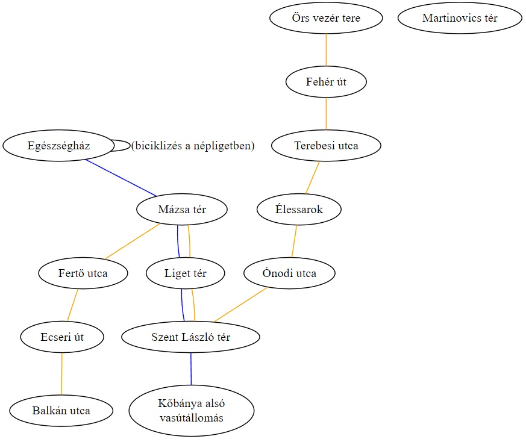

# Gráfok
## Gráfok nem formálisan

Általában az olyan jelenségeket próbáljuk gráfokként formalizálni, amelyek ábrázolása során **csomópontokat** (**csúcsokat**) rajzolunk és amelyeket valamilyen módon **összekötünk**. Az összeköttetéseket általában **éleknek** nevezzük. 

Fontos viszont, hogy a csúcsok helyzete, egymástól való távolsága általában lényegtelen, az összeköttetéseik az egyetlen fontos tulajdonságaik.

### Irányítás
Léteznek irányítatlan gráfok és irányított gráfok. Az irányított gráfoknál nyilakat, az irányítatlan gráfoknál pedig egyszerű vonalakat rajzolunk az ábráinkban: 
#### Példa irányított gráfra
Egy baráti társaság levelezése. A csúcsok az emberek, a nyilak pedig azt mutatják, hogy ki küldött kinek levelet. 


*Ha az egyik ember küldött levelet egy másiknak, még nem biztos, hogy ez visszafele is igaz, ezért fontos az irányítás jelzése.*


#### Példa irányítatlan gráfra
Egy bajnokság pillanatnyi állása. A csúcsok a csapatok, az élek pedig az, hogy játszottak-e már egymással. 


*Ha az egyik játszott a másikkal, akkor nyilván a másik is játszott az egyikkel, tehát nincs értelme megkülönböztetni a élek irányát...*

### Súlyozás
Léteznek súlyozott és nem súlyozott gráfok. A fenti két példa (levelezés és bajnokság) mindegyike súlyozatlan gráfra példa. Léteznek azonban súlyozott gráfok is, ahol az élek valamilyen számszerű értékkel is bírnak. De itt egy példa egy súlyozott, irányítatlan gráfra: 

#### Példa súlyozott gráfra
Távolságok falvak között. A csúcsok falvak, az összekötettés az autóval való közvetlen megközelíthetőséget jelenti. Az élekre felírjuk azt is, hogy pontosan hány kilométerről van szó -- ezek az élek súlyai. Ez ebben az esetben egy pozitív valós számot jelent, de ez nem minden súlyozott gráfra igaz.

[](https://dreampuf.github.io/GraphvizOnline/#graph%20G%20%7B%0A%0A%20%20%0A%C5%90sag%C3%A1rd%20--%20N%C5%91tincs%20%5Blabel%20%3D%20%226.1%22%2C%20weight%20%3D%206.1%5D%3B%0A%C5%90sag%C3%A1rd%20--%20Fels%C5%91pet%C3%A9ny%20%5Blabel%20%3D%20%226.2%22%2C%20weight%20%3D%206.2%5D%3B%0AFels%C5%91pet%C3%A9ny%20--%20Als%C3%B3pet%C3%A9ny%20%5Blabel%20%3D%20%224.6%22%2C%20weight%20%3D%204.6%5D%3B%0AKeszeg%20--%20Als%C3%B3pet%C3%A9ny%20%5Blabel%20%3D%20%226.0%22%2C%20weight%20%3D%206.0%5D%3B%0A%C5%90sag%C3%A1rd%20--%20Keszeg%20%5Blabel%20%3D%20%225.1%22%2C%20weight%20%3D%205.1%5D%3B%0AN%C5%91tincs%20--%20Szendehely%20%5Blabel%20%3D%20%226.1%22%2C%20weight%20%3D%206.1%5D%3B%0AB%C3%A1nk%20--%20Fels%C5%91pet%C3%A9ny%20%5Blabel%20%3D%20%226.5%22%2C%20weight%20%3D%206.5%5D%3B%0AB%C3%A1nk%20--%20Als%C3%B3pet%C3%A9ny%20%5Blabel%20%3D%20%228.5%22%2C%20weight%20%3D%208.5%5D%3B%0AB%C3%A1nk%20--%20R%C3%A9ts%C3%A1g%20%5Blabel%20%3D%20%225.3%22%2C%20weight%20%3D%205.3%5D%3B%0AB%C3%A1nk%20--%20Romh%C3%A1ny%20%5Blabel%20%3D%20%226.9%22%2C%20weight%20%3D%206.9%5D%3B%0AR%C3%A9ts%C3%A1g%20--%20N%C5%91tincs%20%5Blabel%20%3D%20%229.9%22%2C%20weight%20%3D%209.9%5D%3B%0AR%C3%A9ts%C3%A1g%20--%20Szendehely%20%5Blabel%20%3D%20%2210.3%22%2C%20weight%20%3D%2010.3%5D%3B%0ABerkenye%20--%20N%C5%91tincs%20%5Blabel%20%3D%20%226.5%22%2C%20weight%20%3D%206.5%5D%3B%0AN%C3%B3gr%C3%A1d%20--%20Berkenye%20%5Blabel%20%3D%20%222.5%22%2C%20weight%20%3D%202.5%5D%3B%0ASzendehely%20--%20Berkenye%20%5Blabel%20%3D%20%226.9%22%2C%20weight%20%3D%206.9%5D%3B%0ARomh%C3%A1ny%3B%0A%7D)

### Többszörös élek, színezések, hurokélek, izolált csúcsok
#### Többszörös él
Előfordulhat, hogy két csúcs között egynél **több összeköttetés is adódik**. Ilyenkor azt mondjuk, hogy a két csúcs közt többszörös élek vannak. Például mert a város két pontja között busszal és villamossal is lehet közlekedni. 

Ez a helyzet nem feltétlenül váltható ki azzal, hogy súlyozzuk az éleket (ilyenkor pl. 2-őt írva az élre): Ha szeretnénk súlyozni az éleket, mert például a villamos gyorsabb, mint a busz, akkor egyszerűbb ezeket külön élekként (súlyok külön hordozóiként) felfogni. 


#### Színezések

Folytatva az előző példát, akkor sem lehet mindig egyszerű súlyozással helyettesíteni a többszörös éleket, ha valaki **csak** villamossal utazva akar sok megállót megtenni. Ilyenkor nem elég neki az, hogy van *legalább egy* él: neki fontos, hogy az az él pontosan milyen, hiszen ő villamossal akar utazni.

Az ilyen gráfoknál **színezzük az éleket**, például a fenti ábrát úgy reprezentálhatnánk, hogy a kék élek jelölik a buszokat és a sárga élek a villamosokat:

[](https://dreampuf.github.io/GraphvizOnline/#graph%20G%20%7B%0A%0A%22Eg%C3%A9szs%C3%A9gh%C3%A1z%22%20--%20%22M%C3%A1zsa%20t%C3%A9r%22%20%5Bcolor%3Dblue%5D%3B%0A%22M%C3%A1zsa%20t%C3%A9r%22%20--%20%22Liget%20t%C3%A9r%22%20%5Bcolor%3Dblue%5D%3B%0A%22Liget%20t%C3%A9r%22%20--%20%22Szent%20L%C3%A1szl%C3%B3%20t%C3%A9r%22%20%5Bcolor%3Dblue%5D%3B%0A%22Szent%20L%C3%A1szl%C3%B3%20t%C3%A9r%22%20--%20%22K%C5%91b%C3%A1nya%20als%C3%B3%5Cnvas%C3%BAt%C3%A1llom%C3%A1s%22%20%5Bcolor%3Dblue%5D%3B%0A%0A%22%C3%96rs%20vez%C3%A9r%20tere%22%20--%20%22Feh%C3%A9r%20%C3%BAt%22%20%5Bcolor%3Dorange%5D%3B%0A%22Feh%C3%A9r%20%C3%BAt%22%20%20--%20%22Terebesi%20utca%22%20%5Bcolor%3Dorange%5D%3B%0A%22Terebesi%20utca%22%20--%20%22%C3%89lessarok%22%20%5Bcolor%3Dorange%5D%3B%0A%22%C3%89lessarok%22%20--%20%22%C3%93nodi%20utca%22%20%5Bcolor%3Dorange%5D%3B%0A%22%C3%93nodi%20utca%22%20--%20%22Szent%20L%C3%A1szl%C3%B3%20t%C3%A9r%22%20%5Bcolor%3Dorange%5D%3B%0A%22Szent%20L%C3%A1szl%C3%B3%20t%C3%A9r%22%20--%20%22Liget%20t%C3%A9r%22%20%5Bcolor%3Dorange%5D%3B%0A%22Liget%20t%C3%A9r%22%20--%20%22M%C3%A1zsa%20t%C3%A9r%22%20%5Bcolor%3Dorange%5D%3B%0A%22M%C3%A1zsa%20t%C3%A9r%22%20--%20%22Fert%C5%91%20utca%22%20%5Bcolor%3Dorange%5D%3B%0A%22Fert%C5%91%20utca%22%20--%20%22Ecseri%20%C3%BAt%22%20%5Bcolor%3Dorange%5D%3B%0A%22Ecseri%20%C3%BAt%22%20--%20%22Balk%C3%A1n%20utca%22%20%5Bcolor%3Dorange%5D%3B%0A%22Martinovics%20t%C3%A9r%22%3B%0A%22Eg%C3%A9szs%C3%A9gh%C3%A1z%22--%20%22Eg%C3%A9szs%C3%A9gh%C3%A1z%22%20%5Blabel%3D%22(bicikliz%C3%A9s%20a%20n%C3%A9pligetben)%22%5D%3B%0A%7D)

#### Hurokél
A fenti, közlekedéshez hasonló példában is elképzelhetőek akár olyan élek, amelyek ugyanonnan indulnak, ahova jutnak: ezek az ún. **hurokélek**. 

Példa lenne egy hurokélre az, amikor egy városnéző buszra ha felszáll az ember, akkor könnyen lehet, hogy ugyanoda érkezik meg a busz, mint ahonnan elindult, hiszen a nem közlekedési céllal történt az utazás, hanem városnézési céllal. A fenti példában egy népligetbeli biciklizés szolgál kicsit erőltetett példáként a hurokélre.

#### Izolált csúcsok

Az olyan csúcsokat, amelyek nincsenek semmilyen összeköttetésben más csúcsokkal, izolált csúcsoknak nevezzük. Ezekre a fenti példában azok a helyek lennének, ahova nem lehet az érintett járművekkel eljutni, például a Martinovics térre (Budapest e megállókhoz közel eső mértani középpontjába).

## Adatszerkezet/gráfreprezentációk

### Miért nem adunk teljesen általános definíciót
A gráfok rendkívül sokfélék lehetnek, alapvetően egy olyan adatszerkezetről van szó, ami a lehető leglazább rendszereket próbálja összefogni. Ennek megfelelően ha formalizálnánk egy olyan gráf-fogalmat, amely az összes gráfnak hívott jelenséget formalizálja, akkor az általánosság és egyetemesség ára egy rendkívül bonyolult és nehezen kezelhető definíció lenne. Ezért **nem adunk általános, mindent lefedő definíciót**. Általában a különböző alkalmazások is mindig nagyon speciális gráfokat igényelnek, csak az nagyon változatos, hogy és a gráf specialitása miben nyilvánul meg. Tehát a gyakorlatban szinte az a helyzet, hogy ahány feladat van, annyiféle gráfdefiníció létezik. Tehát azt mutatjuk meg, hogy a különböző *gyakori* variánsok hogyan formalizálhatók.

### Jelölési egyszerűsítések
A továbbiakban nagy mértékben leegyszerűsíti a definíciókat, ha **a csúcsok csak 0-ával kezdődő, sorban egymás után következő természetes számok lehetnek.** Ezzel semmilyen részletet nem veszítünk igazából: A fenti levelezős példában azt a további információt, hogy a sorszámok kiket is jelölnek, a nevek egy tömbjében el is tárolhatjuk. A csúcs sorszáma mindig megmondja majd, hogy melyik névről van szó. Hasonlóképpen, a gráfok reprezentációja során sosem kell bajlódnunk azzal, hogy a csúcsok esetleg összetettebbek, mint a sima számok -- ha így lenne, akkor egy tömbben eltároljuk a további információkat, amiket a számok ismeretében konstans idő alatt mindig le lehet majd hívni, amikor szükségünk van ezekre.  

Tehát a reprezentációk mindig abban fognak leginkább különbözni, hogy az éleket, az összeköttetéseket hogyan rögzítik.


A csúcsok sorszámozással való kódolása egyetlen szempontból nem hasznos: Ha a feladatok során a gráfok csúcsokat veszítenek vagy új csúcsokat nyernek. Ilyenkor változik az egész számozás és bonyolult korrigációkat igényel az adatszerkezet. A feladatok között azonban csak nagyon kevés olyan van, ahol nem csak az élek halmaza, de a csúcsok halmaza is változásnak van kitéve.

### Éllista

Az éllistás reprezentációk két-három részből állnak:
- A csúcsok száma
- Tartalmazzák **az élek felsorolását**
- A csúcsokhoz tartalmazó további információkat

A csúcsok számát azért fontos megadni, mert az magas sorszámú izolált csúcsok nem fognak kiderülni az élek listájából. (Az alacsonyak kiderülnek, mert megígértük, hogy sorban zajlik a sorszámozás, tehát ha nincs 3-as számú csúcs, de egy 4-es sorszámú csúcs össze van kötve valamivel, akkor a 3-as számú csúcs izolált kell legyen. De ha az éleknél a legmagasabb sorszámú csúcs a 6-os, akkor nem tudunk semmit arról, hogy létezik-e 10-es csúcs (ami viszont ha van, biztosan izolált.))

#### Informálisan
Például a levelezős példában: 
- 5 csúcs van
- 8 darab él van, mégpedig a következők: 
```
0 -> 1
1 -> 2
1 -> 3
2 -> 4
2 -> 3
3 -> 2
4 -> 2
4 -> 0
```
- A csúcsok további információkat hordoznak. An i sorszámú csúcs az tömb i-edik elemét jelenti: 
```
Laci
Móni
Eszti
Sanyi
Cecília
```

#### Példa arra, hogy nézne ki ez a Mester-en
A Mesteren természetesen minden a lehető legjobban össze van tömörítve. A beolvasás miatt fontos ott megadni az élek számát is. 
```
5 
8
0 1
1 2
1 3
2 4
2 3
3 2
4 2
4 0
Laci
Móni
Eszti
Sanyi
Cecília
```

#### Graphviz reprezentációk
Megjegyezzük, hogy az átláthatósága miatt a népszerű gráfrajzoló nyelv, a graphviz is az éllistás reprezentációt használja. Néhány kép, például a színezéses vagy a súlyozott gráfos példa linkként funkcionál ilyen gráfreprezentációkra. 

#### Feladatra szabott matematikai definíció
A fentihez hasonló gráfok egy éllistás stílusú matematikai reprezentációja valahogy így nézne ki:

Egy gráf alatt a $(N, E, T)$ rendezett hármast értjük, ahol
- $N\in \mathbb N$ a csúcsok száma
- $E\subseteq N\times N$ az éllista
- $T \in \textup{Szöveg}^N$

A fenti példában példában:
- $N = 9$
- $E = \{(0,1),(1,2),(1,3),(2,4),(2,3),(3,2),(4,2),(4,0)\}$
- $T = \textup{("Laci", "Móni", "Eszti", "Sanyi", "Cecília")}$


##### Változatok:
- Az irányított és irányítatlan gráfok reprezentációja ugyanaz lesz. Ezeknek a használata fog eltérni akkor, amikor dolgozunk velük. 
- Súlyozott gráfok esetén a súlyokat az élek mellé szokás írni a mesteres feladatoknál. A matematikai formulaizmust úgy lehetne módosítani, hogy $E\subseteq N \times N \times \mathbb R$
- a többszörös éleket különböző színű éleket úgy lehet kezelni, hogy több $E_1, E_2, \dots$ halmazt adunk meg az élek halmazának. Mesteren úgy lehet ezt szépen megoldani, hogy az élek száma helyett számok tömbjét adjuk meg. Ha például a tömb úgy kezdődik, hogy ``6 10 ... `` Ilyenkor az élhalmaz első 6 eleme az első szín, a következő 10 elem a második szín stb. 

#### Előny

- Az élhalmazos reprezentáció nagyon egyszerűen kezelhető, a gráfelméleti problémák jelentős része egyszerű programozási tételekkel kezelhető feladattá válik. 
- A reprezentáció mérete (memória) és gráfokon futó algoritmusok futási idejei nem függenek a csúcsok számától, csak az élek számától. Ennek megfelelően a kis élszámú gráfok jól, nagyon élszámú gráfok rosszabbul kezelhetők vele.
#### Hátrány 
Minden keresési feladat legalább lineáris időt igényel majd. 
A két legfontosabb feladat:
- az élvizsgálat, azaz annak eldöntése, hogy két megadott csúcs között vezet-e él. Ez egy lineáris keresési feladat (eldöntés programozási tétel), ami **lineáris idejű**.
- a szomszédgyűjtés, azaz egy csúcs szomszédos csúcsainak kiválogatása(kiválogatás programozási tétel), ami szintén **lineáris idejű**.

A következő két gráfreprezentáció abban lesz más, hogy e két feladatra specializálják magukat. A szomszédsági mátrix az élvizsgálatot dönti el konstans idő alatt, a szomszédsági listás reprezentáció pedig a szomszédgyújtést. 

### Szomszédsági mátrix

A szomszédsági mátrixra épülő reprezentációk egyetlen négyzetes mátrixból állnak és a csúcsokhoz tartozó kiegészíő információkból állnak. A mátrixban annyi sor és oszlop van, ahány csúcs, és az i-edik sor j-edik oszlopában az i-edik csúcsból a j-edik csúcsba menő él súlya/megléte szerepel. 

Ha nem súlyozott a gráf, akkor ez egy logikai értékű vagy kétértékű mátrix.

Ha irányítatlan a gráf, akkor ez egy szimmetrikus mátrix.
#### Példa Mesteres reprezentációra

Mesteren meg kell adni a csúcsok számát, hogy tudjuk, hány sort kell a konzolról beolvasni, de ez máshol nem szükséges.

*(Hogy jól jelenjen meg a tabulátoros megjelenítés, nem km-ben, hanem 100méterben adtuk meg a távolságokat.)*

```
11
0	61	62	0	51	0	0	0	0	0	0	
61	0	0	0	0	61	0	99	65	0	0	
62	0	0	46	0	0	65	0	0	0	0	
0	0	46	0	60	0	85	0	0	0	0	
51	0	0	60	0	0	0	0	0	0	0	
0	61	0	0	0	0	0	103	69	0	0	
0	0	65	85	0	0	0	53	0	0	69	
0	99	0	0	0	103	53	0	0	0	0	
0	65	0	0	0	69	0	0	0	25	0	
0	0	0	0	0	0	0	0	25	0	0	
0	0	0	0	0	0	69	0	0	0	0	
Ősagárd
Nőtincs
Felsőpetény
Alsópetény
Keszeg
Szendehely
Bánk
Rétság
Berkenye
Nógrád
Romhány
```

#### Matematikai definíció
A példában szereplő feladatokra a következőképpen lehetne matematikai definíciót adni: 

Gráfnak nevezzük azon $(M, T)$ rendezett párokat, ahol
- $M\subseteq \mathbb R^{N\times N}$, ahol $N\in \mathbb N$ a csúcsok száma
- $T \in \textup{Szöveg}^N$

#### Előny
- Szomszédsági listában tárolva a gráf szerkezetét az élvizsgálat jelentősen leegyszerűsödik. Az $i$-edik csúcsból pontosan akkor vezet él a $j$-edik csúcsba, ha a $M_{i,j}\neq 0$. Ez konstans időt jelent. 
- Súlyozott gráfok nagyon természetesen reprezentálhatók mátrixon. 
- Új élek felvétele nem növeli a memóriahasználatot. Az új csúcsok felvétele viszont négyzetesen növeli a memóriahasználatot. Tehát a mátrixos reprezentáció a "sűrű" gráfokban memóriahatékony, ahol kevés csúcs van sok éllel. 

#### Hátrány
- A szomszédgyűjtési feladat sajnos itt is lineáris idejű: Az $i$-edik csúcs szomszédai a $i$-edik sor 0-tól különböző oszlopainak sorszámai. Ez egy kiválogatás programozási tétel az $i$-edik soron: kiválogatjuk a nemnulla elemeket, ami lineáris időbe telik.
- Szimmetrikus mátrixok esetén minden élt feleslegesen kétszer tárolunk, tehát kétszerannyi memóriát használunk, mint amennyi szükséges lenne. Ez megoldható, ha csak a mátrix felső háromszögét tároljuk egy megfelelő adatszerkezetben, és az alsó háromszögre való hivatkozásokat átfordítjuk a felső háromszögbe. 
- A mátrix mérete a csúcsok számával négyzetesen nő. Míg az éllistás reprezentációban az izolált csúcsok hozzávételei nem növelték a gráf méretét, a mátrixos reprezentációban ezek négyzetesen emelik a memóriahasználatot. 

### Szomszédsági listák

A szomszédsági listák arról szóló beszámolók, hogy egy csúcsnak mely más csúcsok a szomszédai. Tehát ez egy listában a lista-szerkezet lesz, ahol az $i$-edik lista $j$-edik eleme egy csúcs sorszáma, amely szomszédja $i$-nek. 


## Algoritmusok

### Szélességi és mélységi bejárás

```
Függvény El_lehet_e_jutni(graf:Graf, innen:Egész, ide:Egész): Logikai
    Lokális:
        fehér:Egész
        szürke:Egész
        fekete:Egész
        tennivalok: Verem
        szin:Tömb[Egész]
        tennivalo: Egész

    fehér := 0
    szürke := 1
    fekete := 2

    szin := új Tömb[Egész](graf.Csúcsszama)
    tennivalok := új Verem

    tennivalok.Beletesz(innen)
    szin[innen] := szürke

    El_lehet_e_jutni := Hamis

    Ciklus amíg nem El_lehet_e_jutni és nem tennivalók.Üres():
        tennivalo := tennivalok.Kivesz()

        Ha feldolgozando = ide:
            El_lehet_e_jutni := Igaz
            szin[feldolgozando] := fekete
        Egyébként:
            Iteráció szomszéd eleme graf.szomszédai[tennivalo]:
                Ha szín[szomszéd]= fehér:
                    tennivalok.Beletesz(szomszéd)
                    szin[szomszéd] := szürke
                Elágazás vége
            Iteráció vége
        Elágazás vége
    Ciklus vége


Függvény vége.

```

### Legrövidebb út