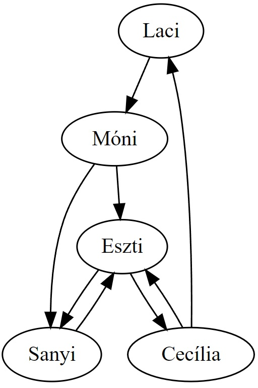
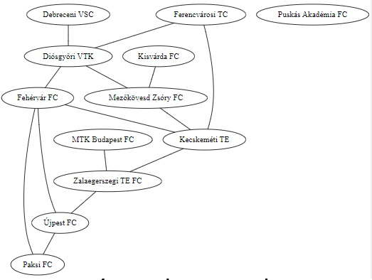
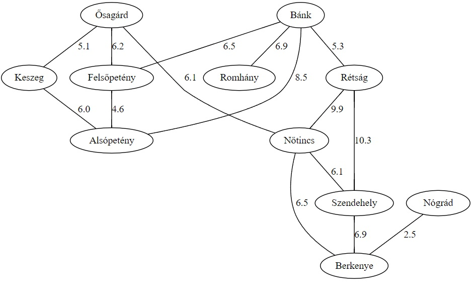

# Gráfok
## Gráfok nem formálisan

Általában az olyan jelenségeket próbáljuk gráfokként formalizálni, amelyek ábrázolása során **csomópontokat** (**csúcsokat**) rajzolunk és amelyeket valamilyen módon **összekötünk**. Az összeköttetéseket általában **éleknek** nevezzük. 

Fontos viszont, hogy a csúcsok helyzete, egymástól való távolsága általában lényegtelen, az összeköttetéseik az egyetlen fontos tulajdonságaik.

### Irányítás
Léteznek irányítatlan gráfok és irányított gráfok. Az irányított gráfoknál nyilakat, az irányítatlan gráfoknál pedig egyszerű vonalakat rajzolunk az ábráinkban: 
#### Példa irányított gráfra
Egy baráti társaság levelezése. A csúcsok az emberek, a nyilak pedig azt mutatják, hogy ki küldött kinek levelet. 



*Ha az egyik ember küldött levelet egy másiknak, még nem biztos, hogy ez visszafele is igaz, ezért fontos az irányítás jelzése.*


#### Példa irányítatlan gráfra
Egy bajnokság pillanatnyi állása. A csúcsok a csapatok, az élek pedig az, hogy játszottak-e már egymással. 




*Ha az egyik játszott a másikkal, akkor nyilván a másik is játszott az egyikkel, tehát nincs értelme megkülönböztetni a élek irányát...*

### Súlyozás
Léteznek súlyozott és nem súlyozott gráfok. A fenti két példa (levelezés és bajnokság) mindegyike súlyozatlan gráfra példa. Léteznek azonban súlyozott gráfok is, ahol az élek valamilyen számszerű értékkel is bírnak. De itt egy példa egy súlyozott, irányítatlan gráfra: 

#### Példa súlyozott gráfra
Távolságok falvak között. A csúcsok falvak, az összekötettés az autóval való közvetlen megközelíthetőséget jelenti. Az élekre felírjuk azt is, hogy pontosan hány kilométerről van szó -- ezek az élek súlyai. Ez ebben az esetben egy pozitív valós számot jelent, de ez nem minden súlyozott gráfra igaz.


## Szabadkozás
A gráfok rendkívül sokfélék lehetnek, alapvetően egy olyan adatszerkezetről van szó, ami a lehető leglazább rendszereket próbálja összefogni. Ennek megfelelően ha formalizálnánk egy olyan gráf-fogalmat, amely az összes gráfnak hívott jelenséget formalizálja, akkor az általánosság és egyetemesség ára egy rendkívül bonyolult és nehezen kezelhető definíció lenne. Ezért **nem adunk általános, mindent lefedő definíciót**. Általában a különböző alkalmazások is mindig nagyon speciális gráfokat igényelnek, csak az nagyon változatos, hogy és a gráf specialitása miben nyilvánul meg. Tehát a gyakorlatban szinte az a helyzet, hogy ahány feladat van, annyiféle gráfdefiníció létezik. Tehát azt mutatjuk meg, hogy a különböző *gyakori* variánsok hogyan formalizálhatók.

(https://dreampuf.github.io/GraphvizOnline/#graph%20G%20%7B%0A%0A%20%20%0A%C5%90sag%C3%A1rd%20--%20N%C5%91tincs%20%5Blabel%20%3D%20%226.1%22%2C%20weight%20%3D%206.1%5D%3B%0A%C5%90sag%C3%A1rd%20--%20Fels%C5%91pet%C3%A9ny%20%5Blabel%20%3D%20%226.2%22%2C%20weight%20%3D%206.2%5D%3B%0AFels%C5%91pet%C3%A9ny%20--%20Als%C3%B3pet%C3%A9ny%20%5Blabel%20%3D%20%224.6%22%2C%20weight%20%3D%204.6%5D%3B%0AKeszeg%20--%20Als%C3%B3pet%C3%A9ny%20%5Blabel%20%3D%20%226.0%22%2C%20weight%20%3D%206.0%5D%3B%0A%C5%90sag%C3%A1rd%20--%20Keszeg%20%5Blabel%20%3D%20%225.1%22%2C%20weight%20%3D%205.1%5D%3B%0AN%C5%91tincs%20--%20Szendehely%20%5Blabel%20%3D%20%226.1%22%2C%20weight%20%3D%206.1%5D%3B%0AB%C3%A1nk%20--%20Fels%C5%91pet%C3%A9ny%20%5Blabel%20%3D%20%226.5%22%2C%20weight%20%3D%206.5%5D%3B%0AB%C3%A1nk%20--%20Als%C3%B3pet%C3%A9ny%20%5Blabel%20%3D%20%228.5%22%2C%20weight%20%3D%208.5%5D%3B%0AB%C3%A1nk%20--%20R%C3%A9ts%C3%A1g%20%5Blabel%20%3D%20%225.3%22%2C%20weight%20%3D%205.3%5D%3B%0AB%C3%A1nk%20--%20Romh%C3%A1ny%20%5Blabel%20%3D%20%226.9%22%2C%20weight%20%3D%206.9%5D%3B%0AR%C3%A9ts%C3%A1g%20--%20N%C5%91tincs%20%5Blabel%20%3D%20%229.9%22%2C%20weight%20%3D%209.9%5D%3B%0AR%C3%A9ts%C3%A1g%20--%20Szendehely%20%5Blabel%20%3D%20%2210.3%22%2C%20weight%20%3D%2010.3%5D%3B%0ABerkenye%20--%20N%C5%91tincs%20%5Blabel%20%3D%20%226.5%22%2C%20weight%20%3D%206.5%5D%3B%0AN%C3%B3gr%C3%A1d%20--%20Berkenye%20%5Blabel%20%3D%20%222.5%22%2C%20weight%20%3D%202.5%5D%3B%0ASzendehely%20--%20Berkenye%20%5Blabel%20%3D%20%226.9%22%2C%20weight%20%3D%206.9%5D%3B%0ARomh%C3%A1ny%3B%0A%7D)


## Adatszerkezet/gráfreprezentációk

### Éllista

### Szomszédsági mátrix

### Szomszédsági listák


## Algoritmusok

### Szélességi és mélységi bejárás

```
Függvény El_lehet_e_jutni(graf:Graf, innen:Egész, ide:Egész): Logikai
    Lokális:
        fehér:Egész
        szürke:Egész
        fekete:Egész
        tennivalok: Verem
        szin:Tömb[Egész]
        tennivalo: Egész

    fehér := 0
    szürke := 1
    fekete := 2

    szin := új Tömb[Egész](graf.Csúcsszama)
    tennivalok := új Verem

    tennivalok.Beletesz(innen)
    szin[innen] := szürke

    El_lehet_e_jutni := Hamis

    Ciklus amíg nem El_lehet_e_jutni és nem tennivalók.Üres():
        tennivalo := tennivalok.Kivesz()

        Ha feldolgozando = ide:
            El_lehet_e_jutni := Igaz
            szin[feldolgozando] := fekete
        Egyébként:
            Iteráció szomszéd eleme graf.szomszédai[tennivalo]:
                Ha szín[szomszéd]= fehér:
                    tennivalok.Beletesz(szomszéd)
                    szin[szomszéd] := szürke
                Elágazás vége
            Iteráció vége
        Elágazás vége
    Ciklus vége


Függvény vége.

```

### Legrövidebb út